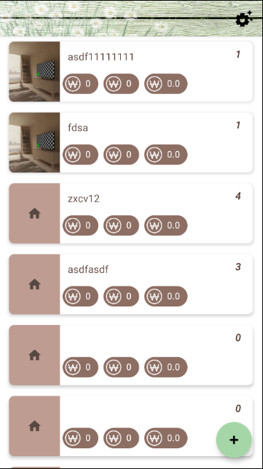
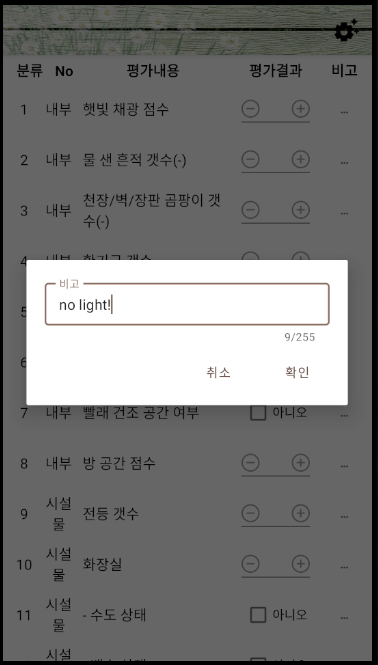

# Weher My Home

집 보러 다닐 때 메모하는 앱

- `MVVM` 집 상세화면([`HomeInfoDetailsFragment.kt`](app/src/main/java/com/minuminu/haruu/wheremyhome/view/homeinfodetails/HomeInfoDetailsFragment.kt))에만 MVVM 적용하여 개발해봤다. 적용 과정은 [3.1.](#viewmodel) 참고. 나머지 뷰는 기본적인 구조로 개발

- `Android Room` Android DB API. [공식가이드](https://developer.android.com/training/data-storage/room) 참고

- `Navigation Component` Fragment 이동 시 `Navigation Component` 활용. 관련 내용은 [3.2.](#navcontroller)나 [공식가이드](https://developer.android.com/guide/navigation/navigation-getting-started) 참고.

## 목차

[1.](#화면-설명) 화면 설명<br>
&nbsp;&nbsp;[1.1.](#1-집-목록-화면) 집 목록 화면<br>
&nbsp;&nbsp;[1.2.](#2-집-상세-화면) 집 상세 화면<br>
&nbsp;&nbsp;[1.3.](#3-사진-전체화면) 사진 전체화면<br>
&nbsp;&nbsp;[1.4.](#4-평가결과-작성) 평가결과 작성<br>
&nbsp;&nbsp;[1.5.](#5-현재-위치-지도) 현재 위치 지도<br>
[2.](#개선할-점) 개선할 점<br>
[3.](#스터디) 스터디<br>
&nbsp;&nbsp;[3.1.](#viewmodel) ViewModel<br>
&nbsp;&nbsp;[3.2.](#navcontroller) NavController<br>
[4.](#license) License<br>

---

## 화면 설명

### 1. 집 목록 화면

- 집 이름/보증금/월세/관리비/Q&A점수 정보를 표시

- 항목을 터치하면 상세화면으로 이동

- 추가(➕) 플로팅 버튼을 눌러 새로운 집 정보 추가

  [`MainActivity.kt`](app/src/main/java/com/minuminu/haruu/wheremyhome/view/main/MainActivity.kt) |
  [`HomeInfoListFragment.kt`](app/src/main/java/com/minuminu/haruu/wheremyhome/view/homeinfolist/HomeInfoListFragment.kt) |
  [`HomeInfoItemRecyclerViewAdapter.kt`](app/src/main/java/com/minuminu/haruu/wheremyhome/view/homeinfolist/HomeInfoItemRecyclerViewAdapter.kt)

  

### 2. 집 상세 화면

- 카메라(📷) 버튼을 눌러 새로운 사진 찍기

- 사진은 여러 장 추가하여 좌우 스크롤 가능

- 사진을 눌러 전체화면으로 보기

- 지도(🗺) 버튼을 눌러 현재 위치 가져오기

  [`HomeInfoDetailsFragment.kt`](app/src/main/java/com/minuminu/haruu/wheremyhome/view/homeinfodetails/HomeInfoDetailsFragment.kt) |
  [`HomeInfoDetailsViewModel.kt`](app/src/main/java/com/minuminu/haruu/wheremyhome/view/homeinfodetails/HomeInfoDetailsViewModel.kt) |
  [`HomeInfoDetailsBindingAdapter.kt`](app/src/main/java/com/minuminu/haruu/wheremyhome/view/homeinfodetails/HomeInfoDetailsBindingAdapter.kt)

   

### 3. 사진 전체화면

- 사진 전체화면

  [`PictureFullScreenActivity.kt`](app/src/main/java/com/minuminu/haruu/wheremyhome/view/picturefullscreen/PictureFullScreenActivity.kt)

  

### 4. 평가결과 작성

- 입력은 +/-정수와 참/거짓

- 비고(···) 버튼을 눌러 비고 항목 작성하는 팝업 노출

  [`EvalInfoRemarkDialog.kt`](app/src/main/java/com/minuminu/haruu/wheremyhome/view/homeinfodetails/components/EvalInfoRemarkDialog.kt)

   

### 5. 현재 위치 지도

- 현재 위치를 찾음

  [`MapsActivity.kt`](app/src/main/java/com/minuminu/haruu/wheremyhome/view/maps/MapsActivity.kt)

  

## 개선할 점

- [x] Q&A는 블로그에서 찾은 내용으로 26가지 고정 질문임. 질문 추가/수정 화면 필요

- [ ] Q&A 점수가 항목별 가중치가 없어 의미없음

- [ ] 사진 전체화면에서 '좌우 스와이프' 기능, '사진 저장' 기능 추가 필요

- 그리고 가장 중요한 실사용 후기... 대충 만들어서 실제 사용해봤는데 방을 금방금방 보다보니 조목조목 체크하기 귀찮아져서 실제 쓸모는 없을 것 같다. 사진, 월세, 위치 저장 기능 정도만 사용.

## 스터디

### ViewModel

- `ViewModel`

```kotlin
class ItemViewModel : ViewModel() {
  /**
   * db 사용할 경우 RoomDatabase 구현체나 Dao를 선언한다.
   *
   * view model과 분리해서 조회 결과만 setter로 넣어줘 '결합도'를 낮출 수 있지만...
   * 귀찮아서 그냥 view model 안에다 선언함
   */
  var db: AppDatabase? = null

  /**
   * Observable (LiveData) 정의
   *
   *     DB/Network -> viewModel
   *
   * 데이터소스(DB, Network 등)로부터 viewModel 값을 받아오는 역할을 한다.
   * LiveData가 값을 받아오면 observer들은 뷰에 값을 갱신하는 작업을 해주면 된다.
   *
   * Activity의 OnCreate나 Fragment의 OnCreateView에서
   * itemLiveData.observe...를 호출하여 하단의 Observable에 매핑하는 부분을
   * 작성한다.
   */
  val itemLiveData = MutableLiveData<Item>()

  /**
   * Observable 정의
   *
   *     viewModel -> view
   *         ... or ...
   *     DB/Network -> viewModel -> view
   *
   * ObservableXXX는 값이 변경되면 연결된 layout view를 갱신하는 역할을 한다.
   *
   * LiveData로부터 값을 매핑받으면 xml이나 databindingAdapter에서 값을 뷰에
   * 표시한다
   */
  val name = ObservableField<String>()
  val address = ObservableField<String>()
  val deposit = ObservableField<String>()
  val rental = ObservableField<String>()
  val expense = ObservableField<String>()
  val startDate = ObservableField<String>()
  val endDate = ObservableField<String>()
  val pictureList: ObservableList<DummyContent.Picture> = ObservableArrayList()
  val qandaList: ObservableList<DummyContent.QandaViewData> = ObservableArrayList()

  fun init(db: AppDatabase) {
    this.db = db
  }

  // db에서 id로 item 조회
  fun setItemId(itemId: String) {
    Thread { // item 로드
      db?.homeInfoDao()?.loadAllByIds(arrayOf(itemId))?.takeIf {
        it.isNotEmpty()
      }?.get(0)?.let { homeInfo ->
        itemLiveData.postValue(homeInfo)
      }
    }.start()
  }

  // db에 item 저장/수정
  // ※ suspend : kotlin coroutine 지시어
  // suspend fun saveItem(): Item { ... }
}
```

- `View`

```kotlin
class ItemFragment : Fragment() {
  // ...
  private var viewModel: ItemViewModel? = null
  private var binding: ItemFragmentBinding? = null

  override fun onCreate(savedInstanceState: Bundle?) {
    super.onCreate(savedInstanceState)

    // viewModel 생성
    viewModel = ViewModelProvider(this).get(HomeInfoDetailsViewModel::class.java).apply {
      init(AppDatabase.getDatabase(requireContext()))
    }
  }

  override fun onCreateView(
    inflater: LayoutInflater, container: ViewGroup?,
    savedInstanceState: Bundle?
  ): View {
    /**
     * binding 생성
     *
     * LayoutInflater 대신 DataBindingUtil의 inflate()를 호출하여 view 생성
     */
    binding = DataBindingUtil.inflate(inflater, R.layout.item_fragment, container, false)
    binding?.viewModel = viewModel
    val view = binding?.root

    // 이벤트 등록 등의 작업 수행
    // ...view?.findViewById(...).setOnClickListener {...}...

    viewModel?.run {
      // db -> liveData
      itemLiveData.observe(viewLifecycleOwner, { it ->
        // [dataBinding 사용] liveData -> observable -> view 적용
        // - ObservableField의 경우 바인딩된 view에 바로 값 세팅
        name.set(it.name)
        address.set(it.address)
        deposit.set(it.deposit.toString())
        rental.set(it.rental.toString())
        expense.set(it.expense.toString())
        startDate.set(it.startDate)
        endDate.set(it.endDate)

        // - ObservableList의 경우 `RecyclerViewAdapter` 및 `DatabindingAdapter`에서 아이템별로 바인딩하는 코드를 작성해야함
        pictureList.clear()
        pictureList.addAll(it.pictures)

        qandaList.clear()
        qandaList.addAll(it.qandas)


        // [dataBinding 사용안하는 경우] 뷰에 직접 넣어줘야 한다
        // ...findViewById(...)?.setText(it.name)...
      })
    }

    // 값 세팅
    if (arguments == null) { // [Add Mode]
      viewModel?.itemLiveData?.postValue(createDummyItem())
      viewModel?.pictureList?.addAll(ArrayList())
      viewModel?.qandaList?.addAll(createDummyQandaList())
    } else { // [Edit Mode]
      arguments?.getString("itemId")?.let {
        viewModel?.loadItemById(it)
      }
    }

    return view
  }

  fun someFunction() {
    // 뷰 입력값 변경하려면...
    // android:text="@={item.name}"
    viewModel?.name?.set("change it")

    // 뷰 입력값 조회
    // android:text="@{item.name}" // 단방향 바인딩 (사용자가 수정한 값은 조회불가)
    // android:text="@={item.name}" // 양방향 바인딩 (사용자가 수정한 값은 조회가능)
    viewModel?.name?.get()
  }
}
```

- `BindingAdapter`

```kotlin
object HomeInfoDetailsBindingAdapter {

  // 사진 추가/삭제 시 호출되어 뷰의 데이터를 갱신한다
  @BindingAdapter("pictures") // 이곳에 속성을 추가하면 xml에서 바인딩 가능해진다
  @JvmStatic // @BindingAdapter 함수는 static 필수
  fun setPictureList(recyclerView: RecyclerView, // 바인딩 대상 뷰
      pictures: List<Picture>) { // @BindingAdapter에 추가한 속성1
  
      val adapter = recyclerView.adapter as PictureItemRecyclerViewAdapter
      adapter.submitList(ArrayList<PictureViewData>().apply {
          addAll(pictures) // diffUtil이 동작하도록 새로운 Array에 넣어줘야 한다.
      })
  }

  @BindingAdapter("pictureName", "deleted")
  @JvmStatic
  fun setImageBitmap(iv: ImageView, pictureName: String, deleted: Boolean) {
      var imageFile = AppUtils.loadSnapshotFile(iv.context, pictureName)
      if (imageFile == null) {
          Log.d(HomeInfoDetailsBindingAdapter::class.simpleName, "loadSnapshotFile is failed")

          imageFile = AppUtils.loadImageFile(iv.context, pictureName).let {
              AppUtils.resizeBitmap(it, iv.width.toFloat(), iv.height.toFloat())
          }
          AppUtils.createSnapshotFile(iv.context, pictureName, imageFile)
      }
      iv.setImageBitmap(imageFile)
      iv.alpha = when (deleted) {
          true -> 0.3f
          else -> 1f
      }
  }
}
```

- `layout`

```text
...
// ObservableField<String> 바인딩
<com.google.android.material.textfield.TextInputEditText
    android:id="@+id/et_name"
    android:layout_width="match_parent"
    android:layout_height="wrap_content"
    android:text="@{viewModel.name}" // 단방향 바인딩
    android:text="@={viewModel.name}" // 양방향 바인딩 (표현식 사용 시 양방향 바인딩은 사용불가)
    android:ems="255"
    android:hint="@string/name"
    android:inputType="text"
    android:maxLength="255" />
...

// ObservableList<Picture> 바인딩
<androidx.recyclerview.widget.RecyclerView
    android:id="@+id/rv_pictures"
    android:layout_width="wrap_content"
    android:layout_height="wrap_content"
    android:orientation="horizontal"
    app:layoutManager="LinearLayoutManager"
    app:pictures="@{viewModel.pictureList}" // @BindingAdapter에 추가한 속성1
    tools:listitem="@layout/item_picture" />
```

### NavController

- `Fragment` 간 이동을 `@navigation/nav_graph.xml`에 명시적으로 작성하여 `FragmentTransaction`을 사용하는 것보다 쉽고 편하게 관리할 수 있다.

  

- `@navigation`

```xml
<?xml version="1.0" encoding="utf-8"?>
<navigation xmlns:android="http://schemas.android.com/apk/res/android"
  xmlns:app="http://schemas.android.com/apk/res-auto"
  xmlns:tools="http://schemas.android.com/tools"
  android:id="@+id/nav_graph"
  app:startDestination="@id/ItemFragment">

  <fragment
    android:id="@+id/ItemFragment"
    android:name="com.minuminu.haruu.wheremyhome.ItemFragment"
    android:label="@string/item_fragment_label"
    tools:layout="@layout/item_fragment">

    <action
      android:id="@+id/action_ItemFragment_to_PictureFullScreenFragment"
      app:destination="@id/PictureFullScreenFragment" />
    <action
      android:id="@+id/action_ItemFragment_to_MapsFragment"
      app:destination="@id/MapsFragment" />
  </fragment>
  <fragment
    android:id="@+id/PictureFullScreenFragment"
    android:name="com.minuminu.haruu.wheremyhome.PictureFullscreenFragment"
    android:label="전체화면"
    tools:layout="@layout/fragment_picture_fullscreen">
  </fragment>
  <fragment
    android:id="@+id/MapsFragment"
    android:name="com.minuminu.haruu.wheremyhome.MapsFragment"
    android:label="지도"
    tools:layout="@layout/fragment_maps" />

</navigation>
```

- `이동`

```kotlin
import androidx.navigation.fragment.findNavController
//...
findNavController().navigate(
  R.id.action_ItemFragment_to_MapsFragment, // @navigation action id
  Bundle().apply {
    putString("address", address)
  })
```

- `이전 Fragment로 이동`

```kotlin
findNavController().popBackStack(R.id.ItemFragment, false)
```

- `SavedState 데이터 변경 리스너`

```kotlin
findNavController().currentBackStackEntry?.savedStateHandle?.getLiveData<String>(
  "address"
)?.observe(viewLifecycleOwner, { address ->
  viewModel?.address?.set(address)
})
```

- `Bundle 데이터 변경`

```kotlin
// Notify data changed
findNavController().previousBackStackEntry?.savedStateHandle?.set(
  "address",
  currentMarker?.title
)
```

## License

> 앱 아이콘 제작자 <a href="https://www.flaticon.com/kr/authors/freepik" title="Freepik">Freepik</a> from <a href="https://www.flaticon.com/kr/" title="Flaticon"> www.flaticon.com</a>

> +/- 아이콘 제작자 <a href="https://www.flaticon.com/authors/dmitri13" title="dmitri13">dmitri13</a> from <a href="https://www.flaticon.com/" title="Flaticon"> www.flaticon.com</a>

> won 아이콘 제작자 <a href="https://www.freepik.com" title="Freepik">Freepik</a> from <a href="https://www.flaticon.com/" title="Flaticon">www.flaticon.com</a>

> on_wood_daisy 이미지 제작자 <a href="https://pixabay.com/ko/users/lillaby-3693608/" title="lillaby">lillaby</a> from <a href="https://pixabay.com/">Pixabay</a>