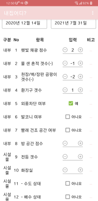

# Weher My Home

집 메모하는 어플

## 화면 설명

### 1. 집 목록 화면

- 집 이름/보증금/월세/관리비/Q&A점수 정보를 표시

- 수정(🖍) 버튼을 눌러 항목 수정

- 추가(➕) 버튼을 눌러 새로운 집 정보 추가

  

### 2. 집 상세 화면

- 카메라(📷) 버튼을 눌러 새로운 사진 찍기

- 사진을 눌러 전체화면으로 보기

- 지도(🗺) 버튼을 눌러 현재 위치 가져오기

- 뒤로가기 버튼을 누르면 수정사항이 저장됨

  


### 3. 사진 전체화면

- 뒤로가기나 화면 터치 후 표시되는 '닫기' 버튼을 눌러 나감

  

### 4. Q&A 작성

- 입력은 +-정수와 참거짓

- 비고(···) 버튼을 눌러 비고 항목 작성하는 팝업 노출

    

### 5. 비고 작성 팝업

- 작성 후 저장

  

### 6. 현재 위치 지도

- 현재 위치를 표시함

- 뒤로가기를 누르면 현재 위치의 주소를 상세화면의 '위치' 입력란에 저장

  

## 개선할 점

- 작성 도중 상세화면이 pause 상태가 되면 수정사항이 초기화되버림. (추후 data binding을 사용하도록 수정하면서 개선할 예정)

- Q&A 점수가 항목별 가중치가 없어 의미없음

- 지도(🗺) 버튼을 누르면 바로 현재 위치를 찾기 때문에 이전에 입력했던 정보가 지워짐. 지도 화면 내부에 '현재위치 찾기' 버튼을 별도 추가 필요

- 그리고 가장 중요한 실사용 후기... 대충 만들어서 실제 사용해봤는데 방을 금방금방 보다보니 조목조목 체크하기 귀찮아져서 실제 쓸모는 없을 것 같다.

## ViewModel

- `ViewModel`

```java
class ItemViewModel : ViewModel() {
    // Observable (LiveData) 정의
    val itemLiveData = MutableLiveData<Item>()

    init {
        // 생성자에서 item이 바로 로드되도록 하거나
        // viewModel이 가진 함수를 호출하여 item이 로드되도록 하면 된다.
        // loadItem()
    }

    fun setItemId(itemId: String) {
        // DB, Http 등으로 item 로드
        Handler(Looper.getMainLooper()).postDelayed({
            DummyContent.ITEM_MAP[itemId]?.let { homeInfo ->
                itemLiveData.postValue(homeInfo)
                picDirLiveData.postValue(homeInfo.picDir)
            }
        }, 1000)
    }
}
```

- `View`

```java
class ItemFragment : Fragment() {

    companion object {
        fun newInstance() = ItemFragment()
    }

    private lateinit var viewModel: ItemViewModel

    override fun onCreateView(
        inflater: LayoutInflater, container: ViewGroup?,
        savedInstanceState: Bundle?
    ): View? {
        val view = inflater.inflate(R.layout.item_details_fragment, container, false)
        // ... view logics (onClick, addView, ...) ...
        return view
    }

    override fun onActivityCreated(savedInstanceState: Bundle?) {
        super.onActivityCreated(savedInstanceState)

        // viewModel를 받아 Observable을 관측한다. (Observable 데이터가 변경되면 콜백을 받음)

        // lifecycle owner를 this로 하면 viewModel이 this의 생명주기를 따른다.
        // (fragment가 destroy되면 viewModel도 destroy)
        viewModel = ViewModelProvider(this).get(ItemViewModel::class.java)

        // Observable 데이터가 변경되면 View에 반영한다.
        viewModel.itemLiveData.observe(viewLifecycleOwner, {
            view?.findViewById<TextInputEditText>(R.id.et_name)?.text?.apply {
                clear()
                insert(0, it.name)
            }
            // ...
        })

        arguments?.run {
            getString("itemId")?.let {
                // viewModel의 item 로드
                viewModel.setItemId(it)
            }
        }
    }
}
```

## License

> 앱 아이콘 제작자 <a href="https://www.flaticon.com/kr/authors/freepik" title="Freepik">Freepik</a> from <a href="https://www.flaticon.com/kr/" title="Flaticon"> www.flaticon.com</a>
